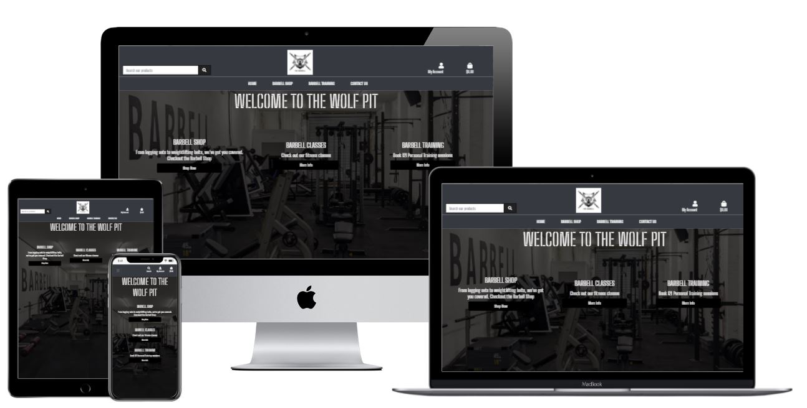

<h1 style="text-align: center">The Barbellgym.com </h1>

This is my submission for Milestone project 4 for Code Institute. The Barbellgym.com is a site for existing and new members of the Barbell Gym to
get information, purchase merchandise and send enquiries on classes and personal training. The goal for this site is to be used to generate income
for the owner of the Barbell Gym and a 'one stop shop' for all new an existing members. 

Live project: [https://thebarbellgym.herokuapp.com/]

### User Experience (UX) ###

* User Story 1 - As a customer, I land on the hompeage of the site and It's clear what the business is.
* User Story 2 - As a customer I can navigate easily to any section of the site regardless of where I am or what device I am using.s
* User Story 3 - As a customer I can easily access the Contact Us page and social media channels through the Footer of the page.
* User Story 4 - As the business owner, I provide customers with a clear and consistent UX in-keeping with the Barbell Gym brand.
* User Story 5 - As a user, I can easily access the different products available from the Barbell shop.
* User Story 6 - As a user, if applicable, I can choose the colour and size of my product before adding to the basket.
* User Story 7 - As a user, I am notified when I have successfully added a product to the basket and the quantity of products added is shown next to the basket icon.
* User Story 8  - As a user I can submit my enquiry about a class or PT session.
* User Story 9 - As an Admin/Superuser I can edit or delete a product.
* User Story 10 - As a customer, when I go to the basket page I can see the the products I have added to basket and overall total of my order.
* User Story 11 - As a customer I can remove a specific item from my basket.
* User Story 12 - As a customer I can adjust the quantity of specific items in my cart.
* User Story 13 - As a customer I can remove all items from my basket with one click.
* User Story 14 - As a customer, I can proceed to the checkout page from the basket review page.
* User Story 15 - As a customer I can choose to save my payment details for next time I make an order.
* User Story 16 - As a customer, through the contact us page I can access the business'  social media accounts and their location on google maps.
* User Story 17 - As a user, I can sign into my account which gives me access to my order history and payment details.
* User Story 18 - As a user, If i'm not signed up I can register for an account.
* User Story 19 - As a customer when I am signed in, I can access my order history, and see my previous orders.

### Design ###

* Colour scheme - The colour scheme is black and white matching the brand and ethos of the business.

* Typography - the 'Big Shoulders Stencil Text' font is used as it is bold, easy to read and suits the military old school
feel of the brand.

* Imagery - The Barbell Gym logo nd images from the gym are shown throughout the site to draw attention as the business' distinctive features. Background images include images
from the gym and classes to provide an insight to users of what the gym looks like, can be seen throughout various pages of the site. Images of the products
were used to show what the products looked like.

* WireFrames:
Desktop and Mobile wireframes - [https://marvelapp.com/prototype/2c593h96]

* Entity relationship diagram

There are 6 models set up in Django DB
    
    Users
    UserProfiles
    Emails
    Orders
    Categories
    Products
    Classes
    Personal Trainers

* Features:
    * Responsive layout on mobile and tablet
    * Collapsible nav bar for mobile view
    * Collapsible menu for displaying logged workouts
    * Authentication (Login/Register functionality)
    * Search
    * Defensive programming

### Technologies: ###

* Languages - 
HTML5
CSS3
JS
Python

* Frameworks/libraries/programs - 
  https://favicon.io/favicon-converter/ - Used to create logo for title.

  https://fonts.google.com/ - used for font design.

  https://www.rawpixel.com/image/2337562/free-illustration-png-frame-black-texture - Used for background image.

  Flask App - https://flask.palletsprojects.com/en/2.0.x/ to run site on and use of Jinja templating and Werkzeug functionality.

  Materialize CSS - https://materializecss.com/ Used for responsiveness and design of site,
  used to implement responsive header, footer and collapsible menu.

  Heroku - https://www.heroku.com/ cloud based platform used to deploy the Barbell planner.

  Free formatter - https://www.freeformatter.com/css-beautifier.html used to beautify CSS3 code.

  W3C markup Validator - https://validator.w3.org/ to check HTML formatting.

  JS Hint - https://jshint.com/ - to test JQuery formatting.

  db diagram - https://dbdiagram.io/ - to create entity relationship diagram

  

### Testing

.

* [W3C Markup validator](https://validator.w3.org/#validate_by_input)

* [W3C CSS validator](https://jigsaw.w3.org/css-validator/validator)

* [JSHint](https://jshint.com/)

* [PEP8 online](http://pep8online.com/checkresult)

### Testing user stories ###

### Further testing ###
     

* Bugs:

* Potential enhancements:

<h2 style="text-align: center">Deployment</h2>

### Credits

### Code ###

### Content ###

#### Image credits ####

### Acknowledgements ###
